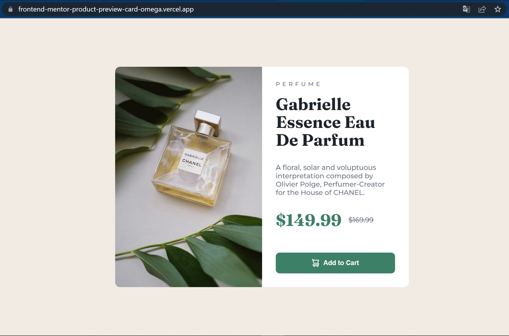
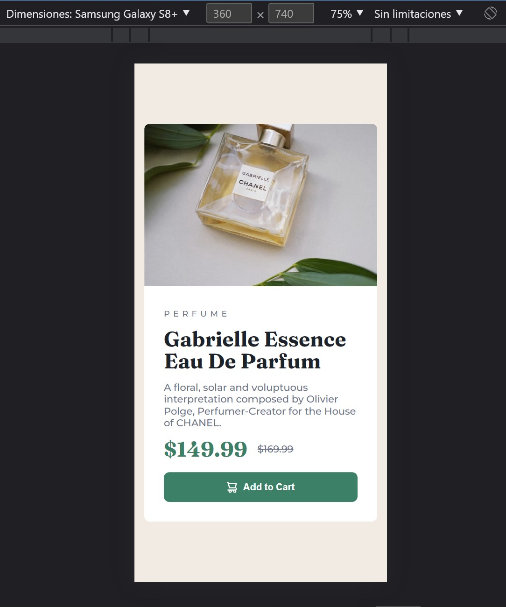

# Frontend Mentor - Product preview card component solution

This is a solution to the [Product preview card component challenge on Frontend Mentor](https://www.frontendmentor.io/challenges/product-preview-card-component-GO7UmttRfa). Frontend Mentor challenges help you improve your coding skills by building realistic projects. 

## Table of contents

- [Frontend Mentor - Product preview card component solution](#frontend-mentor---product-preview-card-component-solution)
  - [Table of contents](#table-of-contents)
  - [Overview](#overview)
    - [The challenge](#the-challenge)
    - [Screenshot](#screenshot)
    - [Links](#links)
  - [My process](#my-process)
    - [Built with](#built-with)
    - [What I learned](#what-i-learned)
  - [Author](#author)
    - [😉 Thank you for your time to review my projects](#-thank-you-for-your-time-to-review-my-projects)

**Note: Delete this note and update the table of contents based on what sections you keep.**

## Overview

### The challenge

Users should be able to:

- View the optimal layout depending on their device's screen size
- See hover and focus states for interactive elements

### Screenshot





### Links

- Solution URL: [📦 Github](https://github.com/jtlaxcalaDev/Frontend-Mentor-product-preview-card)
- Live Site URL: [🚀 Vercel app](https://frontend-mentor-product-preview-card-omega.vercel.app/)

## My process

### Built with

- Semantic HTML5 markup
- CSS custom properties
- Flexbox
- Mobile-first workflow
- [React](https://reactjs.org/)

### What I learned

✨ CSS content, media screen to responsive

```css
@media screen and (max-width: 610px) {
  .card-image {
    content: url('./image.jpg');
  }
}
```

## Author

- Frontend Mentor - [ 👨‍🚀 @jtlaxcalaDev](https://www.frontendmentor.io/profile/jtlaxcalaDev)

### 😉 Thank you for your time to review my projects
